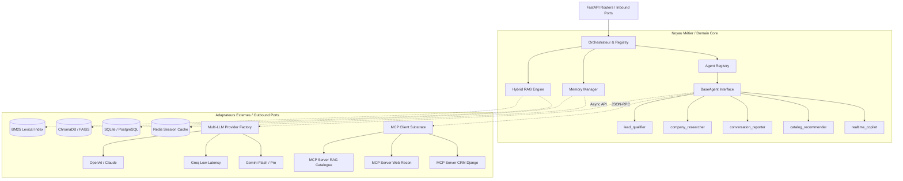

# Architecture Spine — Onbora Core IA

## 0. Brownfield Transition Baseline

The current repository is a synchronous Python/Strands POC organized around
`src/agent.py`, `src/multi_agent.py`, `src/conversation_report.py`, and
`streamlit_app.py`. It provides useful behavior but does not yet implement the
hexagonal, async FastAPI/MCP architecture below.

The source tree in section 5 is the **target structural seed**, not a claim
about files that already exist. During Epic 0, each POC component must receive a
retain/adapt/replace/retire decision. The POC must not leak transport, Streamlit,
or synchronous I/O dependencies into the domain core.

## 1. Design Paradigm

L'architecture d'**Onbora Core IA** suit le patron **Hexagonal (Ports & Adaptateurs)** couplé à un **Registre d'Agents Modulaire** et au substrat standardisé **Model Context Protocol (MCP)**.

```
                      ┌─────────────────────────────────────────┐
                      │          APPLICATION CLIENTES           │
                      │  App Flutter (Mobile) │ App Web / CRM   │
                      └────────────────────┬────────────────────┘
                                           │
                                           ▼ (HTTP / SSE / WebSocket)
┌────────────────────────────────────────────────────────────────────────────────────────┐
│                                 ONBORA CORE IA ENGINE                                  │
│                                                                                        │
│  [PRIMARY / INBOUND ADAPTERS]                                                          │
│  ┌──────────────────────────────────────────────────────────────────────────────────┐  │
│  │ FastAPI Routers : /copilot (SSE), /reports, /chat, /company, /health             │  │
│  └───────────────────────────────────────┬──────────────────────────────────────────┘  │
│                                          │                                             │
│  [DOMAIN & APPLICATION CORE]             ▼                                             │
│  ┌──────────────────────────────────────────────────────────────────────────────────┐  │
│  │ - Orchestrateur Central (Supervisor & Multi-Agent Dispatcher)                     │  │
│  │ - Agent Registry (Découverte & cycle de vie des sous-agents)                     │  │
│  │ - Memory Manager (Working Memory en RAM/Redis + Entity Memory persistante)       │  │
│  │ - Hybrid RAG Engine (Vectoriel Dense + Lexical BM25 + Reciprocal Rank Fusion)    │  │
│  │ - Domain Models & Strict Schemas (Pydantic V2)                                   │  │
│  └───────────────────────────────────────┬──────────────────────────────────────────┘  │
│                                          │                                             │
│  [SECONDARY / OUTBOUND ADAPTERS]         ▼                                             │
│  ┌─────────────────────────┬─────────────────────────┬──────────────────────────────┐  │
│  │ Multi-LLM Providers     │ MCP Client Substrate    │ Persistence Adapters         │  │
│  │ - Gemini (Flash / Pro)  │ - MCP Server CRM Django │ - Redis (Sessions / Cache)   │  │
│  │ - Groq / Mistral        │ - MCP Server Web Recon  │ - SQLite / PostgreSQL (SQL)  │  │
│  │ - OpenAI / Claude       │ - MCP Server RAG Docs   │ - ChromaDB / FAISS (Vectors) │  │
│  └─────────────────────────┴─────────────────────────┴──────────────────────────────┘  │
└────────────────────────────────────────────────────────────────────────────────────────┘
```

### Règles de Dépendance & Flux
* Le **Noyau Métier (Core)** ne dépend d'aucun framework de transport (FastAPI n'est qu'un adaptateur d'entrée).
* Les **Sous-Agents** ne communiquent jamais directement avec des bases de données ou des APIs externes propriétaires : ils passent exclusivement par des **Ports d'outils standardisés MCP** ou des **Ports de Mémoire**.
* Tous les composants internes sont **100% asynchrones (`async/await`)**.

---

## 2. Invariants & Règles d'Architecture (ADs)



### AD-1 — Agent Registry & Découplage Modulaire (Plugin Pattern)
* **Binds:** Tous les sous-agents (`realtime_copilot`, `catalog_recommender`, `company_researcher`, `conversation_reporter`, `lead_qualifier`).
* **Prevents:** Le couplage monolithique dans un script unique (comme `multi_agent.py` dans le POC) ; empêche le blocage de l'évolution du Core IA lors de l'ajout de futurs agents.
* **Rule:** Chaque sous-agent hérite d'une classe abstraite `BaseAgent` définissant : son `agent_id`, son `system_prompt`, ses schémas Pydantic d'entrée/sortie, ses outils MCP déclarés et sa politique de modèle LLM. Les agents s'enregistrent dynamiquement dans `AgentRegistry`.

### AD-2 — Multi-LLM Provider Abstraction & Role Routing
* **Binds:** Tous les appels aux modèles d'IA générative.
* **Prevents:** Le verrouillage sur un seul fournisseur (vendor lock-in) et l'impossibilité d'utiliser un modèle ultra-rapide (< 500ms) pour le copilote terrain tout en gardant un modèle expert pour les rapports.
* **Rule:** Tout appel de modèle transite par une interface `LLMProvider` unifiée (`LLMProviderFactory`). La configuration est pilotée par rôle d'agent via l'environnement (ex: `COPILOT_LLM_PROVIDER=groq`, `REPORTER_LLM_PROVIDER=gemini-pro`).

### AD-3 — Substrat d'Outils MCP (Model Context Protocol)
* **Binds:** Tous les outils externes (CRM Django, recherche web, catalogue RAG, systèmes Orange).
* **Prevents:** La dispersion de fonctions utilitaires codées en dur dans les prompts d'agents et le couplage fort avec des APIs tierces fluctuantes.
* **Rule:** Toute capacité externe est exposée sous forme de serveur MCP standard (JSON-RPC). L'agent interagit avec les outils via le client MCP unifié du Core IA.

### AD-4 — RAG Hybride (Dense Embeddings + Sparse BM25 + Reciprocal Rank Fusion)
* **Binds:** Recherche documentaire et moteur de recommandation du catalogue Orange B2B.
* **Prevents:** Les hallucinations sur les noms exacts de forfaits/options Orange B2B (faiblesse du RAG vectoriel pur) et l'incapacité à comprendre les requêtes formulées en langage naturel imprécis (faiblesse du BM25 pur).
* **Rule:** Toute recherche documentaire exécute en parallèle :
  1. Une recherche sémantique vectorielle (Embeddings).
  2. Une recherche lexicale BM25.
  Les résultats sont réordonnés via l'algorithme RRF (*Reciprocal Rank Fusion*) avant injection des $K$ meilleurs passages dans le contexte de l'agent.

### AD-5 — Double Niveau de Mémoire & Compression Automatique de Contexte
* **Binds:** Gestion des sessions, du copilote et de la persistance client.
* **Prevents:** La saturation de la fenêtre de contexte (token overflow), l'augmentation de latence lors de longues visites (> 45 min) et la perte de mémoire historique entre deux rendez-vous.
* **Rule:** 
  * *Working Memory (Session)* : En RAM / Redis. Si le contexte dépasse un seuil paramétrable (ex: 6 000 tokens), un processus asynchrone de compression génère un résumé compact des faits établis et conserve l'historique des cartes-conseils validées/rejetées.
  * *Entity Memory (Long Terme)* : Stockée dans la base relationnelle (SQLite / PostgreSQL) pour les entités (Entreprises, Contacts, Historique d'échanges).

### AD-6 — Protocole de Streaming Unidirectionnel Non-Bloquant (SSE)
* **Binds:** Endpoints `POST /api/v1/copilot/stream` et `POST /api/v1/chat/message`.
* **Prevents:** Le blocage synchrone des requêtes HTTP et les temps d'attente utilisateur sur les terminaux mobiles Flutter et web.
* **Rule:** Les flux de suggestions copilote et de chat émettent des événements SSE standardisés : `event: status`, `event: suggestion_card`, `event: token`, `event: error`, `event: done`.

### AD-7 — Contrats de Données Stricts & Validation Pydantic V2
* **Binds:** Tous les payloads API, entrées/sorties d'agents et exports CRM (`ConversationReport`, `SuggestionCard`, `CompanyProfile`).
* **Prevents:** Les désynchronisations de format avec le backend Django ou les applications clientes.
* **Rule:** Tous les schémas de données héritent de `pydantic.BaseModel` avec typage strict, validateurs de champs, et documentation intégrée exportée dans le schéma OpenAPI.

### AD-8 — Architecture 100% Asynchrone (Async-First)
* **Binds:** API Gateway, clients LLM, clients MCP, accès base de données et RAG.
* **Prevents:** L'épuisement du pool de threads de FastAPI et la dégradation des performances sous charge concurrente.
* **Rule:** Aucune fonction d'I/O bloquante n'est tolérée dans le code de production. Toutes les opérations d'E/S (réseau, base de données, MCP, fichiers) utilisent `async` / `await`.

---

## 3. Conventions de Cohérence

| Domaine | Convention |
| :--- | :--- |
| **Structure des Dossiers** | Clean architecture : `src/api/` (inbound), `src/core/` (orchestration, agents, memory, rag), `src/adapters/` (mcp, llm, db), `src/schemas/` (pydantic). |
| **Nommage des Agents** | Snake_case avec suffixe `_agent` (ex: `realtime_copilot_agent.py`, `conversation_reporter_agent.py`). |
| **Gestion des Erreurs** | Exceptions domaine personnalisées (`CoreAIException`, `AgentExecutionError`, `RAGRetrievalError`, `MCPConnectionError`) capturées par un middleware global FastAPI retournant un JSON d'erreur standard `{ "error": { "code": "...", "message": "...", "details": {} } }`. |
| **Format des Données** | Dates en ISO 8601 UTC (`YYYY-MM-DDTHH:MM:SSZ`), UUIDv4 pour les identifiants de session et de carte conseil. |
| **Configuration** | Pydantic Settings (`pydantic-settings`) chargé depuis `.env` avec validation stricte au démarrage. |

---

## 4. Stack Technologique (Seed Pinning)

| Composant | Technologie & Version | Rôle & Justification |
| :--- | :--- | :--- |
| **Runtime** | Python `>= 3.11` | Performance asynchrone native et typage avancé. |
| **API Framework** | `FastAPI >= 0.115.0` + `uvicorn >= 0.32.0` | Serveur ASGI asynchrone ultra-performant, OpenAPI automatique. |
| **Framework Agents & LLM** | `strands-agents >= 1.0.0` / SDK Gemini / LiteLLM | Gestion native des agents Gemini et abstraction multi-fournisseurs. |
| **Validation & Contrats** | `pydantic >= 2.9.0` + `pydantic-settings >= 2.6.0` | Sérialisation et validation de schémas ultra-rapide. |
| **Protocole Outils** | `mcp >= 1.2.0` (Model Context Protocol Python SDK) | Standardisation de la communication avec les outils. |
| **RAG & Vector Store** | `chromadb >= 0.5.0` ou `faiss-cpu >= 1.8.0` + `rank-bm25 >= 0.2.2` | Moteur hybride dense/lexical sans dépendance cloud obligatoire. |
| **Session Cache / Fast Storage** | `redis >= 5.1.0` (optionnel local) / Memory fallback | Gestion de la mémoire vive court terme et du streaming. |
| **Persistance Long Terme** | `SQLAlchemy >= 2.0.0` + `aiosqlite >= 0.20.0` / `asyncpg >= 0.30.0` | Base relationnelle asynchrone (SQLite dev / PostgreSQL prod). |

---

## 5. Arborescence du Code Source (Structural Seed)

```text
c:\dev\onboracoreai/
├── src/
│   ├── main.py                           # Point d'entrée de l'application FastAPI
│   ├── config.py                         # Paramètres Pydantic Settings & variables d'environnement
│   │
│   ├── api/                              # Adaptateurs d'Entrée (Inbound Ports / Routers)
│   │   ├── __init__.py
│   │   ├── router.py                     # Enregistrement central des routes API v1
│   │   ├── dependencies.py               # Injection de dépendances FastAPI (auth, DB, orchestrator)
│   │   └── v1/
│   │       ├── copilot.py                # POST /copilot/stream (SSE) & /copilot/feedback
│   │       ├── reports.py                # POST /reports/generate (JSON Pydantic)
│   │       ├── chat.py                   # POST /chat/message (Chatbot Inbound)
│   │       ├── company.py                # POST /company/research (Company Recon)
│   │       └── health.py                 # GET /health & GET /agents
│   │
│   ├── core/                             # Cœur Métier & Orchestration (Domain Core)
│   │   ├── __init__.py
│   │   ├── orchestrator.py               # Superviseur central et routage de messages
│   │   ├── registry.py                   # Agent Registry (découverte et cycle de vie des agents)
│   │   │
│   │   ├── agents/                       # Définitions des sous-agents modulaires
│   │   │   ├── base.py                   # Classe abstraite BaseAgent
│   │   │   ├── realtime_copilot.py       # Sous-agent Copilote terrain (détection & cartes conseils)
│   │   │   ├── catalog_recommender.py    # Sous-agent Matching offres Orange B2B
│   │   │   ├── conversation_reporter.py  # Sous-agent Rapport commercial structuré
│   │   │   ├── company_researcher.py     # Sous-agent Recherche & Enrichissement web
│   │   │   └── lead_qualifier.py         # Sous-agent Diagnostic Inbound prospect
│   │   │
│   │   ├── memory/                       # Gestionnaire de Mémoire Double Niveau
│   │   │   ├── manager.py                # MemoryManager unifié
│   │   │   ├── working_memory.py         # Mémoire de session (RAM/Redis) avec compression de contexte
│   │   │   └── entity_memory.py          # Mémoire long terme (SQLite/Postgres) des entreprises
│   │   │
│   │   └── rag/                          # Moteur RAG Hybride
│   │       ├── engine.py                 # Moteur de recherche hybride (Dense + BM25 + RRF)
│   │       ├── vector_store.py           # Adaptateur ChromaDB / FAISS
│   │       ├── lexical_index.py          # Index BM25 sur le catalogue & FAQ
│   │       └── ingest.py                 # Pipeline d'ingestion (PDF, Markdown, JSON)
│   │
│   ├── adapters/                         # Adaptateurs de Sortie (Outbound Adapters)
│   │   ├── __init__.py
│   │   ├── llm/                          # Fournisseurs LLM (Gemini, Groq, OpenAI, Claude)
│   │   │   ├── factory.py                # Factory d'instanciation de modèles par rôle
│   │   │   ├── gemini_adapter.py
│   │   │   └── groq_adapter.py
│   │   │
│   │   ├── mcp/                          # Intégration Model Context Protocol
│   │   │   ├── client.py                 # Client MCP central
│   │   │   └── servers/                  # Serveurs MCP intégrés au Core IA
│   │   │       ├── crm_django_server.py  # MCP Server pour backend Django
│   │   │       ├── web_recon_server.py   # MCP Server pour recherche web
│   │   │       └── rag_docs_server.py    # MCP Server pour consultation documentaire
│   │   │
│   │   └── storage/                      # Persistance
│   │       ├── database.py               # Connexion SQLAlchemy async (SQLite / PostgreSQL)
│   │       └── redis_client.py           # Client Redis asynchrone
│   │
│   └── schemas/                          # Contrats de Données & Modèles Pydantic V2
│       ├── __init__.py
│       ├── copilot.py                    # SuggestionCard, StreamChunk, CopilotFeedback
│       ├── report.py                     # ConversationReport (schéma strict Django/CRM)
│       ├── company.py                    # CompanyProfile, ReconSummary
│       └── chat.py                       # ChatMessage, LeadQualificationResult
│
├── data/                                 # Données & Connaissances Orange B2B
│   ├── catalog/                          # Catalogue JSON structuré des offres Orange B2B
│   │   └── orange_b2b_offers.json
│   └── docs/                             # Fiches PDF / Markdown d'argumentaires et FAQ
│
├── tests/                                # Suite de tests automatisés
│   ├── unit/
│   │   ├── test_agents.py
│   │   ├── test_rag_hybrid.py
│   │   └── test_memory_compression.py
│   └── integration/
│       ├── test_copilot_stream_api.py
│       ├── test_reports_api.py
│       └── test_mcp_servers.py
│
├── Dockerfile                            # Conteneurisation de production
├── docker-compose.yml                    # Stack locale (Core IA + Redis + Postgres)
├── pyproject.toml / requirements.txt     # Dépendances du projet
└── README.md                             # Documentation d'installation et guide d'intégration API
```

---

## 6. Matrice Traçabilité : Exigences (FR) → Composants d'Architecture

| Exigence FR | Composant Responsable | Invariant / Règle Associée |
| :--- | :--- | :--- |
| **FR-1** (Streaming Copilote SSE) | `src/api/v1/copilot.py` & `src/core/agents/realtime_copilot.py` | AD-6 (SSE Unidirectionnel), AD-8 (Async-First) |
| **FR-2** (Feedback Commercial) | `src/api/v1/copilot.py` & `src/core/memory/working_memory.py` | AD-5 (Working Memory), AD-7 (Pydantic Schema) |
| **FR-3, FR-18** (Rapport `ConversationReport`) | `src/api/v1/reports.py` & `src/core/agents/conversation_reporter.py` | AD-7 (Schéma strict), AD-2 (Gemini Pro routing) |
| **FR-4** (Recherche Entreprise) | `src/api/v1/company.py` & `src/core/agents/company_researcher.py` | AD-3 (MCP Web Recon Server) |
| **FR-5** (Chatbot Inbound) | `src/api/v1/chat.py` & `src/core/agents/lead_qualifier.py` | AD-6 (Streaming Response), AD-4 (RAG Hybride) |
| **FR-6, FR-7** (Multi-LLM & Agent Registry) | `src/core/registry.py` & `src/adapters/llm/factory.py` | AD-1 (Agent Registry), AD-2 (Multi-LLM Factory) |
| **FR-8, FR-9** (Cartes Conseils & Anti-Spam) | `src/core/agents/realtime_copilot.py` | AD-1 (BaseAgent), AD-7 (SuggestionCard Schema) |
| **FR-10, FR-11, FR-12** (RAG Hybride & Indexation) | `src/core/rag/engine.py` & `src/adapters/mcp/servers/rag_docs_server.py` | AD-4 (Dense + BM25 + RRF), AD-3 (MCP Server) |
| **FR-13, FR-14** (Mémoire Session + Long Terme) | `src/core/memory/working_memory.py` & `src/core/memory/entity_memory.py` | AD-5 (Double Niveau de Mémoire & Compression) |
| **FR-15, FR-16, FR-17** (Serveurs MCP) | `src/adapters/mcp/servers/` | AD-3 (Substrat MCP JSON-RPC) |

---

## 7. Décisions Différées (Deferred)

1. **Transcription Audio Server-Side (STT Dédié)** : Différé à la V2 — les applications Flutter et Web gèrent l'enregistrement et la transcription initiale en V1.
2. **Cluster Multi-Nœuds Distribué (Kubernetes / Ray)** : Différé — l'architecture FastAPI conteneurisée sur Docker Compose avec Redis permet d'absorber la charge requise pour l'Orange Summer Challenge sans complexité opérationnelle superflue.
3. **Connecteurs CRM Tierces hors Django (Salesforce / HubSpot)** : Différé — l'implémentation du serveur MCP CRM Django sert de référence immédiate ; les autres connecteurs MCP seront ajoutés via des plugins sans modifier le code de l'orchestrateur.
